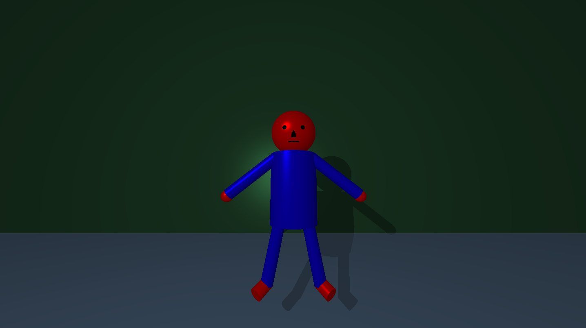

<div align="center">
  <h1>⚙️ miniRT (a <a href="https://42perpignan.fr/">42</a> project) ⚙️</h1>
  
  <p>Subject: <a href="ressources/en.subject.pdf">en.subject.pdf</a></p>
</div>

<div align="center">
  <h2>✅ Grade</h2>
  
</div><br>

## <div align="center">📄 Introduction</div>
This project consists in creating a small **raytracer** in C language using CPU. For this reason, its features are limited. We also had to use the miniLibX as graphic library.

For this project, we had to work in team with another student. Special thanks to [Nico](https://github.com/Floperatok) who has been the perfect teammate again, as it was our second project together. We decided to do 2 versions of the program, in order to learn 100% of the project each one. You can find his beautiful version of miniRT on [his github profil](https://github.com/Floperatok/42-miniRT).

This project was done during 42 cursus at 42 Perpignan in March of 2024 with bonus.
<br><br>

## <div align="center">⭐ Bonus</div>
All bonuses have been done. It consisted in adding the following features:
- Specular reflection
- Color disruption: checkerboard
- Colored and multi-spot lights
- One other second degree object: Cone, Hyperboloid, Paraboloid...
- Handle bump map textures
<br><br>

## <div align="center">🗺️ Maps</div>
As parameter, the program takes **.rt** maps. It handles comment lines (the line must starts with **#**).
Here is a global model that you can use to create and test your maps:

```
#################################################################################################
########################################### MAP TITLE ###########################################
#################################################################################################

####################################### AMBIANT LIGHTNING #######################################
#	ID												RATIO				COLOR					#

############################################ CAMERA #############################################
#	ID		POSITION			DIRECTION			FOV											#

############################################ LIGHTS #############################################
#	ID		POSITION								RATIO				COLOR					#

############################################ PLANES #############################################
#	ID		POSITION			NORMAL									COLOR			REFLECT	#

############################################ SPHERES #############################################
#	ID		POSITION								DIAM				COLOR			REFLECT	#

########################################### CYLINDERS ###########################################
#	ID		POSITION			DIRECTION			DIAM	HEIGHT		COLOR			REFLECT	#

############################################# CONES #############################################
#	ID		POSITION			DIRECTION			DIAM	HEIGHT		COLOR			REFLECT	#
```

You can find this in [model.rt](maps/model.rt)</a>
<br><br>

## <div align="center">🛠️ Features</div>
- **Multiple objects:**
    - Planes
    - Spheres
    - Cylinders
    - Cones
- **Multi-spot and colored lights**
- **Specular reflection**
- **Objects reflection**
- **Bump mapping**
- **Textures mapping**
- **Multi-threading**
- **Small and very basic anti-aliasing**
<br><br>

## <div align="center">💻 Usage</div>
Clone `miniRT` and enter in the repository:
```sh
git clone https://github.com/Arawyn42/42_miniRT && cd 42_miniRT
```

- For linux users, you will need to install the following packages:
```sh
sudo apt-get update && sudo apt-get install xorg libxext-dev zlib1g-dev libbsd-dev && sudo apt-get upgrade
```
- For Mac and Windows user you can refer to the unofficial [minilibx doc](https://harm-smits.github.io/42docs/libs/minilibx/getting_started.html) and modify the Makefile.

Compile the project:
```sh
make
```

Execute it with the following command:
```sh
./miniRT [MAP] [NUMBER_OF_THREADS] [ANTI_ALIASING]
```
Replace:
- *[MAP]* with the path of the map of your choice
- *[NUMBER_OF_THREADS]* with the number of threads you want to run in parallel. The program will be faster with a number of threads around the window's height (810 by default; the resolution can be changed in the [minirt.h](includes/minirt.h) header). This parameter is optional. **By default, there will be no thread**.
- *[ANTI_ALIASING]* with 1 if you want to set it ON, or 0 if you want to set it OFF. This parameter is optional. **By default, anti-aliasing is set on OFF**.
<br><br>

## <div align="center">📂 Examples</div>





